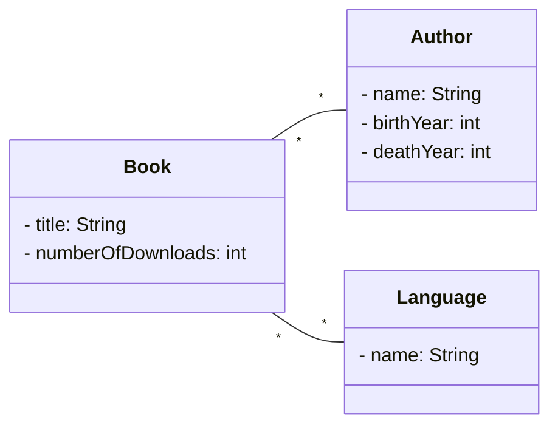

```mermaid
classDiagram
  direction LR
  class Book {
    - title: String
    - numberOfDownloads: int
  }

  class Author {
    - name: String
    - birthYear: int
    - deathYear: int
  }

  class Language {
    - name: String
  }

  Book "*" -- "*" Author
  Book "*" -- "*" Language
```